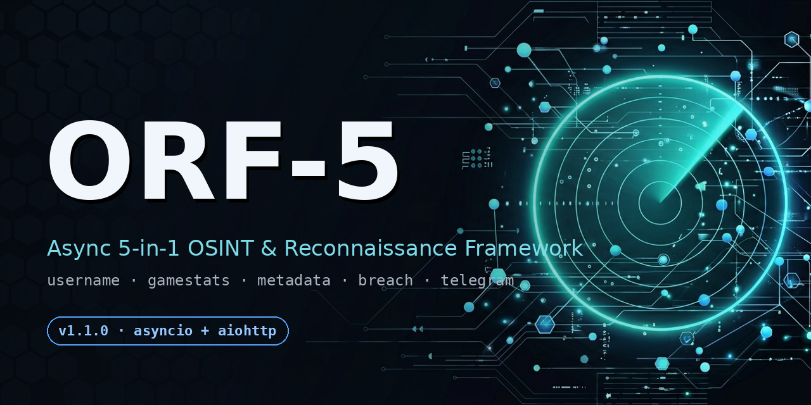
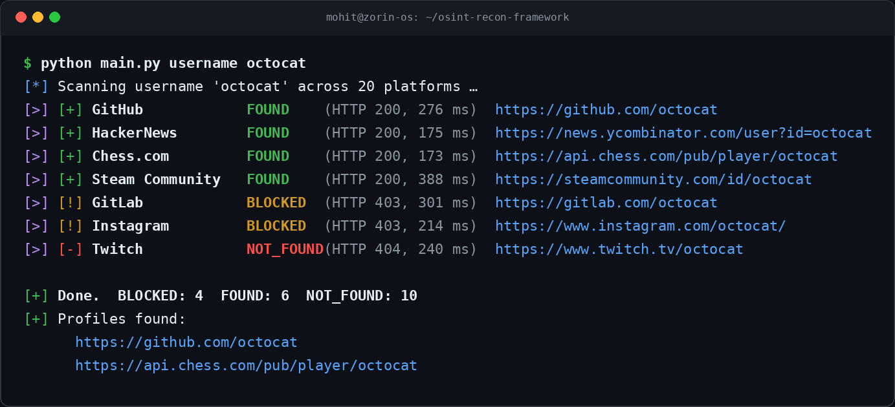
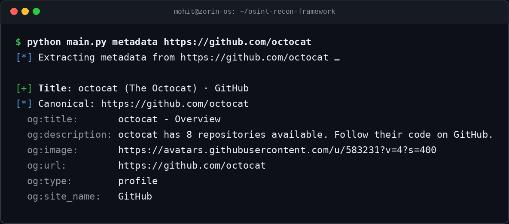
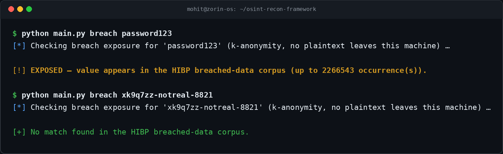

<div align="center">




[](https://mohittt-vermaa.github.io/osint-recon-framework/)
[](https://codespaces.new/mohittt-vermaa/osint-recon-framework)

# ORF-5

**An async 5-in-1 OSINT & reconnaissance toolkit.**
Point it at a username, a game UID, a URL or an email — it tells you what's public.
Nothing more, nothing less.

Built on `asyncio` + `aiohttp`, so all probes run concurrently instead of one-by-one.
Runs anywhere Python runs: Windows, Zorin OS, any Linux distro, macOS — even **Termux on your phone**.

[Features](#what-it-does) · [Install](#installation) · [Usage](#usage) · [Telegram bot](#telegram-bot) · [🌐 Website](https://mohittt-vermaa.github.io/osint-recon-framework/) · [⭐ Star it](#if-this-helped-you)

</div>

---

## What it does

Five modules, one entry point:

| # | Module | Command | What it checks |
|---|--------|---------|----------------|
| 1 | Username Recon | `username` | Profile existence across 20 social/gaming networks, judged by HTTP status + body rules. Platforms live in a JSON file — add your own without touching code. |
| 2 | Game Stats Inspector | `gamestats` | Public player data by UID/name — Free Fire MAX and PUBG. |
| 3 | Metadata Extractor | `metadata` | Open Graph / Twitter Card tags (`og:image`, `og:description`, …) from any public page. No login, ever. |
| 4 | Breach Exposure Checker | `breach` | k-Anonymity SHA-1 range queries against HaveIBeenPwned. Only a 5-char hash prefix leaves your machine. |
| 5 | Dual Interface | `bot` | Everything above, also drivable from a Telegram bot (aiogram 3). |

### Why another username scanner?

Most of them are synchronous — they hit one site, wait, hit the next. ORF-5 fans every probe
out concurrently with a shared connection pool, randomized User-Agents, strict timeouts and
retries with jittered backoff. A full 20-platform scan usually finishes in about a second.

Sites that reject bots (looking at you, Instagram) aren't silently ignored and aren't faked —
they're reported as `BLOCKED`, so you know the difference between "no profile" and "couldn't tell".

```
[*] Scanning username 'octocat' across 20 platforms …
[>] [+] GitHub             FOUND      (HTTP 200, 276 ms)  https://github.com/octocat
[>] [+] Chess.com          FOUND      (HTTP 200, 173 ms)  https://api.chess.com/pub/player/octocat
[>] [!] GitLab             BLOCKED    (HTTP 403, 301 ms)  https://gitlab.com/octocat
[>] [-] Twitch             NOT_FOUND  (HTTP 404, 240 ms)  https://www.twitch.tv/octocat

[+] Done.  BLOCKED: 4  FOUND: 6  NOT_FOUND: 10
```

## Screenshots

Real CLI output, rendered straight from actual sessions (regenerate any time with
`python scripts/render_assets.py`):

<p align="center">
  
  
  
</p>

## Requirements

- Python **3.9 or newer** (3.11+ recommended)
- An internet connection
- Optional keys, only if you want the extras:

| Key | Where to get it | Needed for |
|-----|-----------------|-----------|
| `PUBG_API_KEY` | https://developer.pubg.com (free) | PUBG player lookups |
| `HIBP_API_KEY` | https://haveibeenpwned.com/API/Key (paid) | Detailed e-mail breach listing — the k-anonymity check works without any key |
| `TELEGRAM_BOT_TOKEN` | @BotFather on Telegram | The bot interface |

---

## Installation

Pick your platform. Every path ends the same way: `.venv` created, dependencies installed, `.env` ready.

### ⚡ Zero-install — run it straight from GitHub

[](https://codespaces.new/mohittt-vermaa/osint-recon-framework)

No local setup at all: GitHub spins up a cloud devbox with everything pre-installed
(thanks to `.devcontainer/`) and you're running `python main.py username …` in about a
minute — from any device, including a phone.

### 📱 Android — Termux

Works in the stock Termux app (F-Droid build recommended; the Play Store build is outdated).

```bash
pkg update && pkg upgrade -y
pkg install -y python git
git clone https://github.com/mohittt-vermaa/osint-recon-framework.git
cd osint-recon-framework
bash install.sh
source .venv/bin/activate

python main.py username octocat
```

> If `pkg` complains about repositories, run `termux-change-repo` and pick a working mirror, then retry.

### 🐧 Linux — Zorin OS / Ubuntu / Debian

Zorin is Ubuntu-based, so plain `apt` works. This covers GNOME Terminal, Konsole, xterm — any terminal emulator, the shell commands are the same.

```bash
sudo apt update
sudo apt install -y python3 python3-venv python3-pip git
git clone https://github.com/mohittt-vermaa/osint-recon-framework.git
cd osint-recon-framework
bash install.sh
source .venv/bin/activate
```

Fedora:

```bash
sudo dnf install -y python3 git
git clone https://github.com/mohittt-vermaa/osint-recon-framework.git
cd osint-recon-framework && bash install.sh && source .venv/bin/activate
```

Arch / Manjaro:

```bash
sudo pacman -S --needed python git
git clone https://github.com/mohittt-vermaa/osint-recon-framework.git
cd osint-recon-framework && bash install.sh && source .venv/bin/activate
```

### 🍎 macOS

```bash
brew install python git
git clone https://github.com/mohittt-vermaa/osint-recon-framework.git
cd osint-recon-framework
bash install.sh
source .venv/bin/activate
```

### 🪟 Windows

Get Python first — either from [python.org](https://www.python.org/downloads/) (**tick "Add python.exe to PATH"** during setup) or:

```
winget install Python.Python.3.12
```

Then clone and run the matching installer for your terminal:

**cmd / Command Prompt**
```bat
git clone https://github.com/mohittt-vermaa/osint-recon-framework.git
cd osint-recon-framework
install.bat
.venv\Scripts\activate
```

**PowerShell / Windows Terminal**
```powershell
git clone https://github.com/mohittt-vermaa/osint-recon-framework.git
cd osint-recon-framework
.\install.ps1
.venv\Scripts\Activate.ps1
```

> If PowerShell refuses to run the script, allow local scripts once:
> `Set-ExecutionPolicy -Scope CurrentUser RemoteSigned`

### 🔧 Manual install (any OS, any shell)

If you'd rather not use the scripts:

```bash
python -m venv .venv
source .venv/bin/activate        # Windows: .venv\Scripts\activate
pip install -r requirements.txt
cp .env.example .env             # Windows: copy .env.example .env
```

---

## Usage

```bash
python main.py username octocat                        # scan all 20 platforms
python main.py username octocat --only github,steam    # just a few
python main.py username octocat --output report.json   # save a JSON report

python main.py gamestats --game freefire --id 1234567890
python main.py gamestats --game pubg --id "PlayerName" --shard steam

python main.py metadata https://github.com/octocat

python main.py breach someone@example.com              # k-anonymity, no key needed
python main.py breach someusername --kind username

python main.py bot                                     # start the Telegram bot
python main.py --version
```

Tuning knobs for every command: `--timeout`, `--connect-timeout`, `--concurrency`, `--retries`.

## Telegram bot

1. Message [@BotFather](https://t.me/BotFather) → `/newbot` → copy the token.
2. Put it in `.env` as `TELEGRAM_BOT_TOKEN` (or pass `--token`).
3. `python main.py bot`
4. Talk to your bot:

| Command | Example |
|---------|---------|
| `/username <handle>` | `/username octocat` |
| `/gamestats <game> <id>` | `/gamestats freefire 1234567890` |
| `/metadata <url>` | `/metadata https://github.com/octocat` |
| `/breach <email or username>` | `/breach someone@example.com` |

## Adding platforms

Open `config/platforms.json`. Each entry supports a `url` with a `{username}` placeholder,
optional `headers`, and match rules: `found_status`, `not_found_status`, `body_contains`,
`body_not_contains`. Sites that always answer HTTP 200 (Steam, Telegram, HackerNews…)
are handled with the body rules — see their entries for examples. No code changes needed.

## Troubleshooting

- **Instagram / X / TikTok show `BLOCKED`** — expected. They filter non-browser traffic hard.
  The result is honest, not a bug.
- **GitLab flips between FOUND and BLOCKED** — their rate limiter is aggressive; lower
  `--concurrency` if it bothers you.
- **Free Fire lookup says "provider unavailable"** — Garena killed the official API, so ORF-5
  uses a public wrapper. If it moves, swap the URL in `modules/game_stats.py` (`FREEFIRE_PROVIDER`).
- **`pip` fails on Termux** — run `pkg upgrade`, then `pip install --upgrade pip` and retry.
- **SSL errors on Windows** — upgrade pip inside the venv and reinstall; a stale Python 3.8
  install is the usual culprit.
- **Bot token rejected** — tokens from BotFather are single source of truth; re-check for
  stray spaces in `.env`.

## Roadmap

- [ ] HTML report export (`--output report.html`)
- [ ] More gaming networks in the platform schema
- [ ] Proxy support (`--proxy`)
- [x] Termux compatibility
- [x] JSON exports for every module

## Contributing

Found a platform worth adding, a provider that died, or a bug? Open an issue or send a PR —
details in [CONTRIBUTING.md](CONTRIBUTING.md). Keep changes focused and test on at least one
of Windows or Linux before submitting.

### Social kit

Sharing ORF-5 somewhere? Ready-made promo assets (banners, terminal screenshots,
reel/YouTube cuts, QR code) and copy-paste captions for X / Instagram / YouTube
live in [`social/`](social/) — regenerate the visuals any time with
`python scripts/render_assets.py` and `python scripts/render_social.py`.

## If this helped you…

ORF-5 is built and maintained in spare time. If it saved you an evening or taught you
something about async Python, **give the repo a star ⭐** — it costs nothing and it's the
single best signal that the work is worth continuing.

<div align="center">

**⭐ Star this repo if you like it — and feel free to fork it and make it yours. ⭐**

</div>

## Legal

ORF-5 only touches **publicly available data**. Use it on accounts and identifiers you own
or are authorized to investigate, respect each platform's Terms of Service, and follow your
local privacy laws (DPDP Act, GDPR and friends). Don't use it for stalking or harassment —
that's on you, not the tool.

## License

[MIT](LICENSE) — use it, modify it, ship it. Attribution appreciated, not required.
